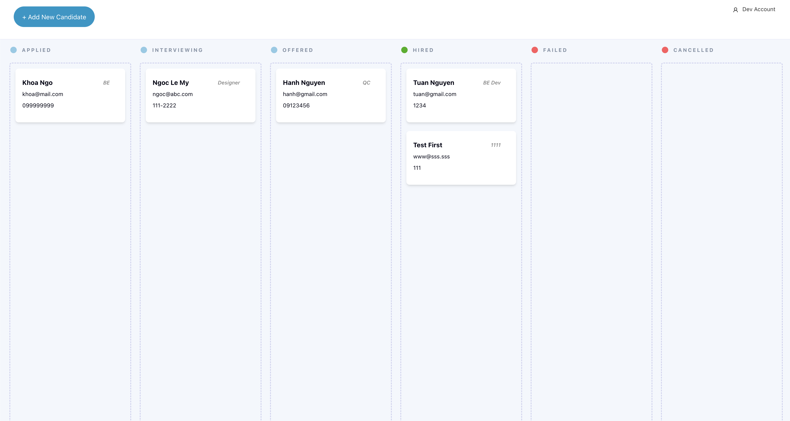

# Candidate Management

### Tech-stack
- Backend: Asp.NET Core WebAPI with .NET 8
- Frontend: Angular 17, using TaigaUI
- Database: MongoDB



## Step to setup
1. Goto folder `backend` run the following command to create the database instance and init default collections
```
docker-compose up --build
```

It is supposed that the docker-compose file will build and setup the Backend web API instance also. I will update the script late on

2. Open and Run the Backend project

3. Go to folder `frontend` open it and run the  Angular script in the `README` file inside that folder
4. Please make sure you have Node version.18 on your machine. Use this command to switch to it before building the code
```
nvm use 18
```

## Account for test
After you setup the database successfully. You can use this account to login at the Login page on Frontend Web
```
username: dev@gmail.com
password: Password12!@
```

--------------------------------
## Things I can do better
#### For Backend
1. Apply FluentValidation
2. Apply AutoMapper
3. Apply CQRS approach using MediatR
4. Apply C# 12 structure
   
#### For Frontend
1. Fix font-size issue of TaigaUI input components
2. Optimize UX of the Drag/Drop stuff


---
#### Reference And License
As I take some reference from other Github repositories, so just feel free to get my code.
And please give me a ⭐ if you like this repo 😊. 
